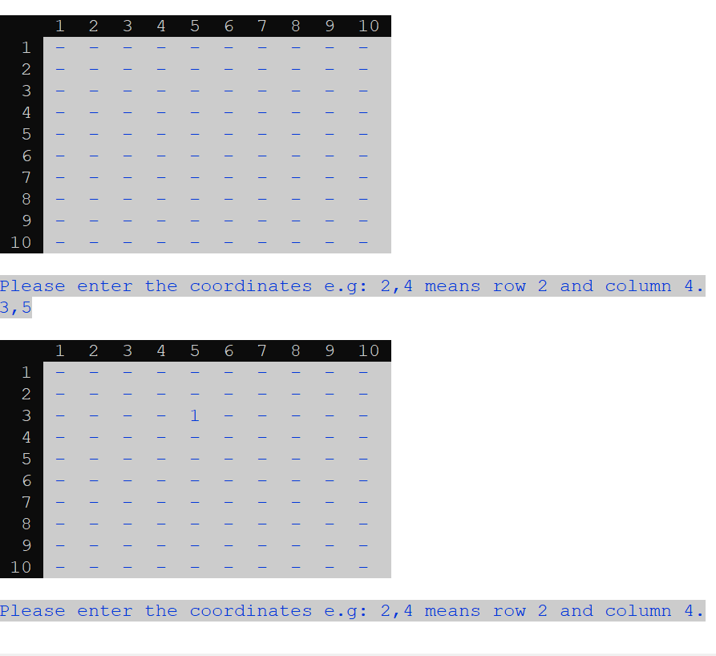
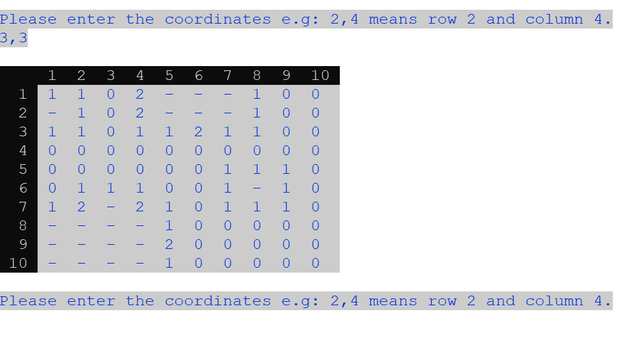
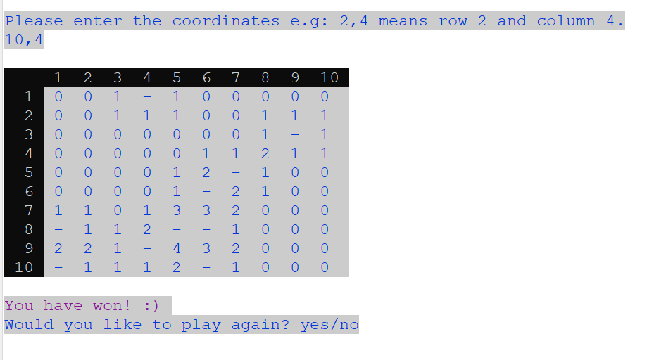

# MINESWEEPER GAME - JAVA

## **Table of Contents** 

  - [**Table of Contents**](#table-of-contents)
  - [**Description**](#description)
  - [**My experience**](#my-experience)
      - [**Algorithm**](#algorithm)
  - [**Usage**](#usage)
  - [**Technologies Used**](#technologies-used)
  - [**Preview**](#preview)
  - [**Deployed link**](#deployed-link)
  - [**Future Development**](#future-development)
  - [**Questions**](#questions)


## **Description**

This project was designed to recreate a Java version of the popular Minesweeper game where the user can play using the terminal/console. The game asks for coordinates, draws the field and tells the player if they win or lose.

- The player can provide the input coordinates using comma separated values where the first number is the row and the second is the column. 
- The game matrix renders each time the player provides coordinates.
- The game features a cascading effect which reveals all the numbers around the zeros.
- If the players wins, the message "You have won :)" is displayed.
- If the player loses, the message "You have lost :(" is displayed and the matrix displays the location of the mine.
- Each time that the player wins or loses they can choose to play again answering "yes" or exit saying "no".


## **My experience**

This project enhanced my knowlodge in Java as it was the first time I had written an application with it. I was able to practice and implement Java concepts that I have learnt in theory.

To displayed a mine/bomb I chose an ASCII character to differentiate it from the other text. This is the ASCII code of the chosen character: 9677. 

For this project I styled the interface inside the console by using the ANSI Color Codes. I chose a grey background to simulate the real game color, the text with a dark blue and some messages with purple. 

More information about how to use these colours can be found 
[here](https://www.geeksforgeeks.org/how-to-print-colored-text-in-java-console/)

### **Algorithm**

To implement the numbers around the mines I sat to think about the sequence that was happening around a mine. 
In this case a mine was a number greater than eight, eight being the maximun mines than can be around a coordinate. 
Given a mine, all the cells around the mine needed to be increment by 1, which resulted in those cells indicating the total number of mines that were around them. 
Initially I increment each cell around the mine using methods called top-right, botton-left, etc. There were some edge cases where a cell could not be increment if the adjacent mine was located in a corner or an edge of the matrix. 

To refactor this algorithm the vectors were applied, so instead of having 8 different functions to check each cell around the mine, only one function was needed. 

## **Usage**

```
Using Eclipse or a bash terminal/console, run/execute the Main class. 
```

## **Technologies Used**

* Java

## **Preview**

* **Matrix - providing the coordinates**




* **Cascading**




* **Lost the game :(**


* **Win the game :)**



## **Deployed link**

💡 Live version: [To be deployed - click here!]()

## **Future Development**

* The interface can be changed from using the console to using a Graphical User Interface (GUI).

## **Questions**

* Contact me on my GitHub profile: [Marcela's GitHub](https://github.com/marcelamejiao)